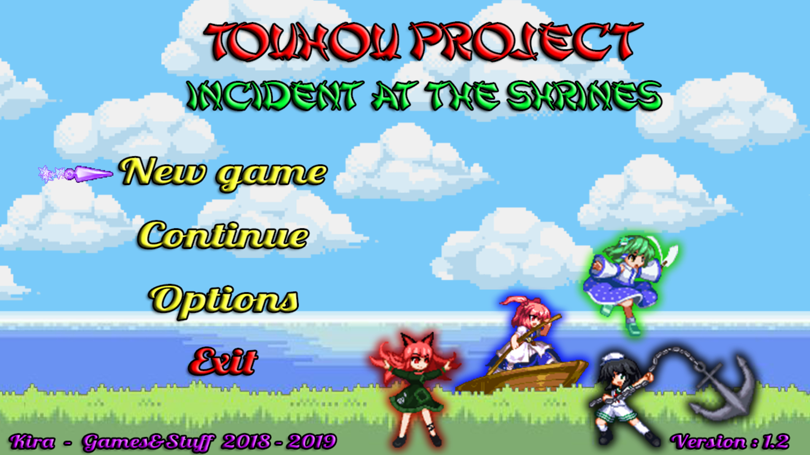
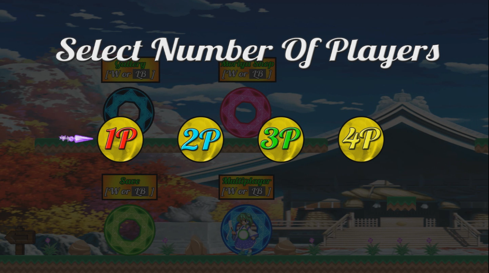
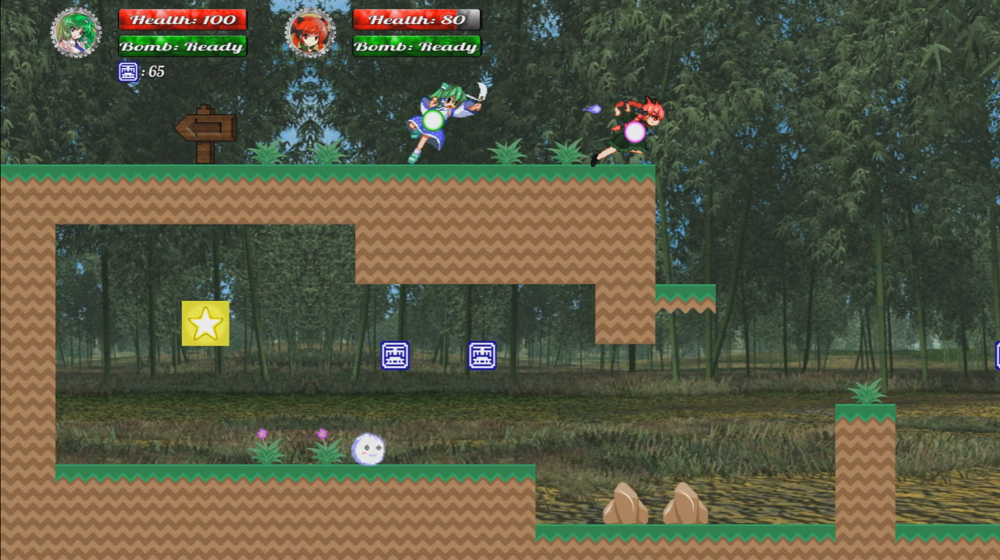
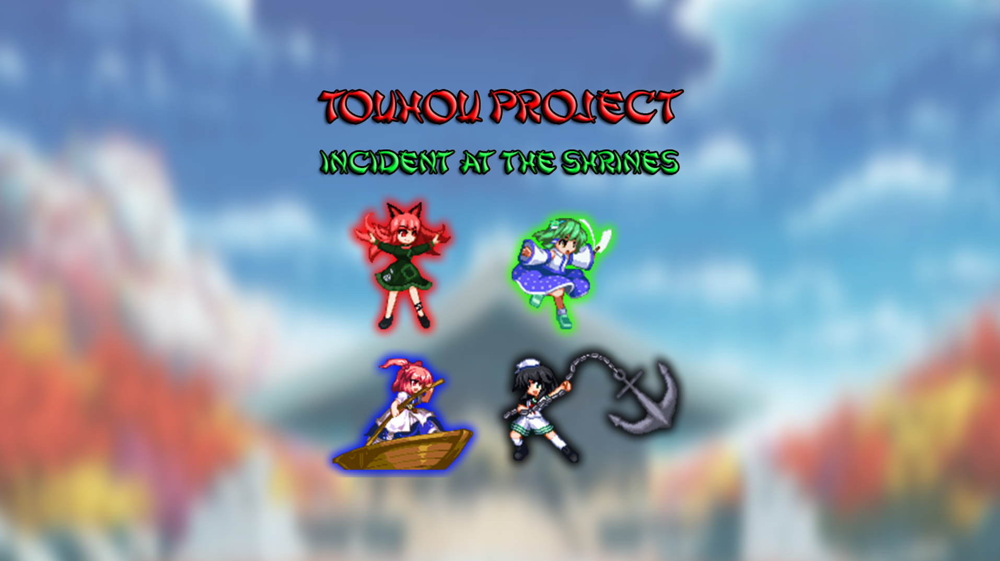

# Touhou Fangame - Incident At The Shrines
Welcome everybody. This repository is to host a little Touhou fangame I made back in 2018. This game is completely free and I don't own anything from Touhou Project mark, all rights are reserved to ZUN and Team Shangai Alice.
- It's a local coop 2D platform game up to 4 players at the same time. 
- A huge explosion happened on Gensokyo and Sanae is looking for clues alongside Komachi, Rin and Murasa. 
- The game is divided in worlds with stages and a boss each one.
- You can only save at Moriya's Shrine, make sure to pay a visit everytime you clear a world.
- If the player (or players in coop) dies, it respawns at Moriya's Shrine.
- Default controls for keyboard are arrow keys to move and crouch, Z to jump, X to attack, C to run, A to shoot, S for special, Q for show hitbox, W to interact, M for map, P to pause the game and V to flip the character (you can change every key but move and crouch).
- Second player needs a controller to play, being the left joystick used to move and crouch, A to jump, X to attack, Y for special, B to shoot, Select for map, Right bumper for run, Left bumper to interact, L3 for show hitbox, Start to pause and R3 to flip the character (on a Xbox controller).

Here's some screenshots of the game:

  

  

  

You can also watch a full coop gameplay if you want [part one here](https://youtu.be/erMKwnB7c74), [part two here](https://youtu.be/zleH54sjBHg) and [final part here](https://youtu.be/vUTnNB2UKM8)

  

